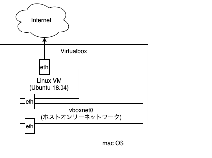

# 対象とする環境

本演習では、特に指定がない限りは以下の環境を用いて研修を行います。

+ MacOS 10.14 Mojave
+ VirtualBox 6.1.4 r136177
+ Ubuntu 18.04.1 （VirtualBox上の仮想マシン）

## 仮想マシンの構成

仮想マシン構成は以下の通りに設定してください。

|設定名|設定値|備考|
|---|---|---|
|CPUコア数|2||
|メモリ|4GB||
|ストレージ|50GB||
|ネットワーク (アダプタ1)|NAT||
|ネットワーク (アダプタ2)|ホストオンリーアダプタ|IPv4アドレスが`192.168.56.1/24`となっていると スムーズになるかもしれません。|

アダプタが2つあり、これを設定することでVM内ではなく、
macからsshを使って仮想マシンにスムーズにアクセスできるようになります。

VirtualBoxのネットワーク設定については[10_(補足)Virtualboxのネットワーク](10_(補足)Virtualboxのネットワーク設定.md)を参照してください。

## 仮想マシン内部の構成

あらかじめ以下の設定をUbuntu上で実施しておくとスムーズです。

+ openssh-severのインストール
  + インストールされていない場合はインストールしてください
+ 公開鍵方式を使ったsshアクセス
  + macの公開鍵を配置してパスワードなしでログインできるようにしておく
+ パスワードなしでのsudo
  + パスワードなしでsudoを実行できるようにしておく

なお、本設定はあくまでも研修用の設定です。
実際の環境では、プロジェクト毎のプロジェクトポリシーによって
設定が異なるので注意してください。

本設定内容については、[20_(補足)仮想マシンの設定](20_(補足)仮想マシンの設定.md)を参照してください。
