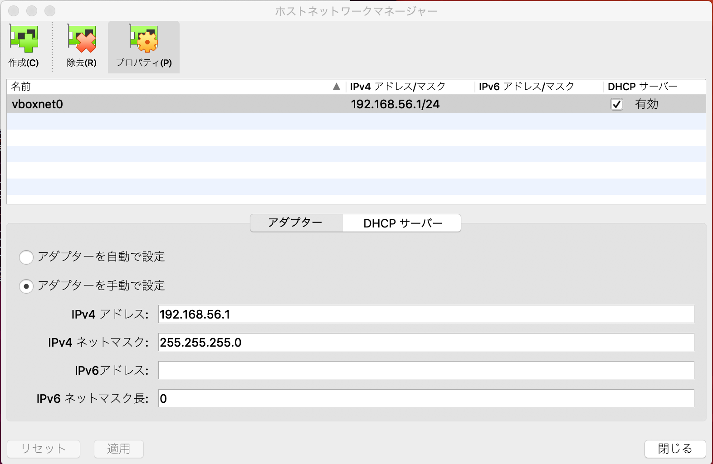
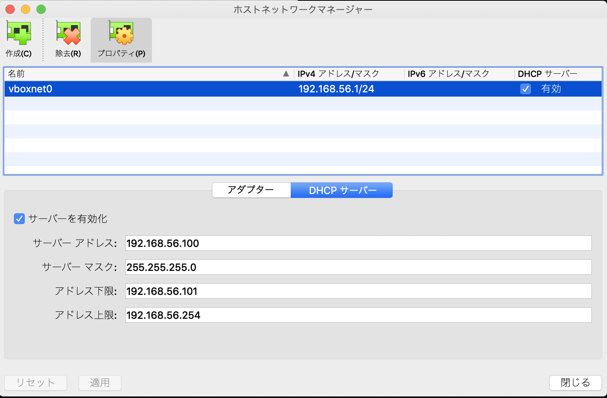

# （補足）VirtualBoxのネットワーク設定

VirtualBoxで仮想マシンのネットワーク設定を行う際に、
ホストオンリーネットワークを設定できないことがあります。

ほとんどの場合は、VirtualBox側の設定の不足に起因するため、
その解説をここで行います。

VirtualBoxの画面を開き、ファイル -> ホストネットワークマネージャをクリックします。
作成ボタンをクリックしてvboxnet0を作りましょう。

DHCPサーバボタンをクリックしてDHCPサーバが構成されているかを確認しましょう。
(デフォルトでは有効化されているはずです)

ここまで設定すれば、ホストオンリーネットワークのアダプタを仮想マシンに設定できるようになるはずです。