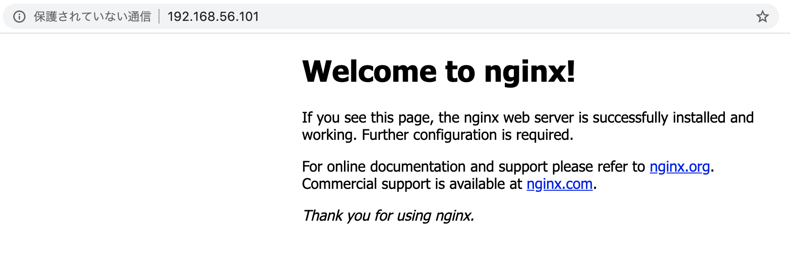

# Ansibleを使ったnginxのインストール

https://github.com/Fufuhu/ansible_nginx にアクセスして、
リポジトリをcloneしてください。(forkしてcloneでも可)

今回解説するコードはひと通りリポジトリ内部に含んでいます。

## Ansibleの主要な概念

Ansibleを構成する主要な概念としては以下の3つです。

1. インベントリ
2. プレイブック
3. タスク

### インベントリ

インベントリは作業対象となるノードとの接続情報を記載したファイルです。ターゲットとなるノードのIPアドレスやFQDNを記述します。
`inventory/inventory.ini`ファイルを確認してみましょう。

```ini
[nginx]
192.168.56.101
```

今回の場合はセットアップ対象のノードは一台のみなので、ごくシンプルになっています。
`nginx`のグループ内に、`192.168.56.101`のノードが定義されているだけです。

例えば、これとは別に[Apache Tomcat](https://tomcat.apache.org/)のノードを準備したい場合は以下のようになるでしょう。

```ini
[nginx]
192.168.56.101

[tomcat]
192.168.56.108
```

さらに、nginxを複数のサーバにセットアップしたい場合は以下のように記述します。

```ini
[nginx]
192.168.56.101
192.168.56.103
192.168.56.104

[tomcat]
192.168.56.108
```

インベントリについては、他にも様々な形の設定が可能なので、
[公式ドキュメント](https://docs.ansible.com/ansible/2.9/network/getting_started/first_inventory.html)などを参照しつつ、学んでいくと良いでしょう。

### プレイブックとタスク

プレイブック(Playbook)は設定したい事柄について順序立てて定義したファイルです。
プレイブックは1つ以上のタスクから構成されます。


タスクはどのホストグループに対して、何を設定したいかを定義する内容になります。


ではPlaybookの中身を見ていきましょう。

#### プレイブックの中身の解説

`playbook/main.yml`は、以下のように記述されています。

```yaml
---
- hosts: nginx
  roles:
    - nginx
```

ここでは、`inventory.ini`の`nginx`グループ内のホストに、
nginxロール向けのタスクを適用するといった記述になっています。

では、nginxロール向けのタスクを見ていきましょう。
`playbook/roles/nginx/tasks/main.yml`を見てみます。

```yaml
---
- import_tasks: install_nginx.yml
```

`import_task`で`install_nginx.yml`をタスクをインポートしています。
では、`install_nginx.yml`をみてみると以下のようになっています。

```yaml
---
# nginxをインストールする
- name: Install nginx
  become: yes
  apt:
    name:
      - nginx
    state: present
# サーバが起動した際にnginxのプロセスが起動するようsystemdを設定
- name: Automatically start nginx when the server starts
  become: yes
  systemd:
    name: nginx
    enabled: yes
# nginxが停止している場合は、起動
- name: Start nginx
  become: yes
  systemd:
    name: nginx
    state: started
```

全体を解説しているとキリがないので、一部のみ解説します。

```yaml
- name: Install nginx
  become: yes
  apt:
    name:
      - nginx
    state: present
```

上記の`Install nginx`タスクでは、 Ansibleのaptモジュールを使って、
nginxパッケージが導入されている状態(=存在する状態, present)にします。

## 実際にデプロイしてみる

`ansible-playbook`コマンドを使ってデプロイします。
`-i`オプションでインベントリを定義したファイルを指定し、
適用したいプレイブックを指定すると、プレイブックが実行され
nginxのインストールが行われます。

```console
$ ansible-playbook -i inventory/inventory.ini playbook/main.yml

PLAY [all] ***********************************************************************************

TASK [Gathering Facts] ***********************************************************************
ok: [192.168.56.101]

TASK [nginx : Install nginx] *****************************************************************
ok: [192.168.56.101]

TASK [nginx : Automatically start nginx when the server starts] ******************************
ok: [192.168.56.101]

TASK [nginx : Start nginx] *******************************************************************
ok: [192.168.56.101]

PLAY RECAP ***********************************************************************************
192.168.56.101             : ok=4    changed=0    unreachable=0    failed=0    skipped=0    rescued=0    ignored=0   

(local) RyomanoMacBook-Pro:ansible_nginx fujiwara$ ansible-playbook -i inventory/inventory.ini playbook/main.yml 

PLAY [nginx] *********************************************************************************

TASK [Gathering Facts] ***********************************************************************
ok: [192.168.56.101]

TASK [nginx : Install nginx] *****************************************************************
ok: [192.168.56.101]

TASK [nginx : Automatically start nginx when the server starts] ******************************
ok: [192.168.56.101]

TASK [nginx : Start nginx] *******************************************************************
ok: [192.168.56.101]

PLAY RECAP ***********************************************************************************
192.168.56.101             : ok=4    changed=0    unreachable=0    failed=0    skipped=0    rescued=0    ignored=0   

(local) RyomanoMacBook-Pro:ansible_nginx fujiwara$ ansible-playbook -i inventory/inventory.ini playbook/main.yml 

PLAY [nginx] *********************************************************************************

TASK [Gathering Facts] ***********************************************************************
ok: [192.168.56.101]

TASK [nginx : Install nginx] *****************************************************************
ok: [192.168.56.101]

TASK [nginx : Automatically start nginx when the server starts] ******************************
ok: [192.168.56.101]

TASK [nginx : Start nginx] *******************************************************************
ok: [192.168.56.101]

PLAY RECAP ***********************************************************************************
192.168.56.101             : ok=4    changed=0    unreachable=0    failed=0    skipped=0    rescued=0    ignored=0   

(local) RyomanoMacBook-Pro:ansible_nginx fujiwara$ ansible-playbook -i inventory/inventory.ini playbook/main.yml 

PLAY [nginx] *********************************************************************************

TASK [Gathering Facts] ***********************************************************************
ok: [192.168.56.101]

TASK [nginx : Install nginx] *****************************************************************
ok: [192.168.56.101]

TASK [nginx : Automatically start nginx when the server starts] ******************************
ok: [192.168.56.101]

TASK [nginx : Start nginx] *******************************************************************
ok: [192.168.56.101]

PLAY RECAP ***********************************************************************************
192.168.56.101             : ok=4    changed=0    unreachable=0    failed=0    skipped=0    rescued=0    ignored=0
```

nginxのインストールが完了したので、インベントリの`nginx`グループに含まれている
192.168.56.101にwebブラウザでアクセスしてみると、nginxがインストールされ、
動作していることが確認できます。



## まとめと補足

本章では、Ansibleを使ってNginxをインストールしました。
これだけでは、手動で作業をした場合と比較して手間が増えただけに見えます。
もう少しスコープを広げて考えてみるとメリットが見えてきます。

**例えば、スケールを大きく変えてみましょう。
1000台のサーバーに1時間でインストールしなければいけない場合、
手動作業ではあまり現実的とは言い難いでしょう。**

また、今回はAnsibleを仮想マシン上のOSの構成管理に利用しました。
しかし、Ansible自体は仮想マシン以外にもネットワーク機器などで利用可能です。

## 追加課題

今回使ったPlaybookを修正して、以下のhtmlを
今回準備したサーバにアップロードし、
ウェブブラウザで閲覧できるようにしてください。

```html
<html>
  <head>
    <title>サンプル</title>
  </head>
  <body>
    <h1>
    これはAnsibleを使ってデプロイされたHTMLファイルです
    </h1>
  </body>
</html>
```

参考として、公式ドキュメント（[Module Index](https://docs.ansible.com/ansible/latest/modules/modules_by_category.html))などを中心に探してみてください。

## さらに学ぶには

さらに学ぶための参考書等のリストをあげておきます。

+ [Ansible実践ガイド 第3版 (impress top gear)](https://www.amazon.co.jp/dp/4295007641)
  + 講師は本格的にAnsibleを使い始めた時にこれと公式ドキュメントを中心に学習した
+ [Ansible構築・運用ガイドブック ~インフラ自動化のための現場のノウハウ~ (Compass Booksシリーズ) ](https://www.amazon.co.jp/dp/4839969388)
  + RedHatでサポートエンジニアをされているひよこ大佐本。評判が良いので読んでみて感想を教えてください。(講師未読)
+ [初めてのAnsible](https://www.amazon.co.jp/dp/4873117658)
  + オライリーの書籍。対象バージョンが古いので差分に注意。
+ [Ansible Documentation](docs.ansible.com)
  + 公式ドキュメント、ある程度基本を掴んだら公式ドキュメントを参照しながら学んでいきましょう。