# GitLab CI/CDを使った継続的インテグレーション

GitLabには、[GitLab CI/CD](https://docs.gitlab.com/ee/ci/)と呼ばれる機能があり、
CIおよびCDのための機能が提供されています。

ここでは、[30_docker-composeを使ったテスト](../20_dockerを使ったローカルテスト/30_docker-composeを使ったテスト.md)で利用していたリポジトリを使ってGitLabを使った継続的インテグレーションを体験します。

## GitHubリポジトリとGitLabリポジトリの連携

GitLabにはGithub上のリポジトリの連携機能があり、
今回はこの機能を利用してGitLabのCI機能のみを利用します。

アカウントがない場合もGitHubアカウントを使ってログイン可能です。
`Sign in with`の`GitHub`を使ってください。

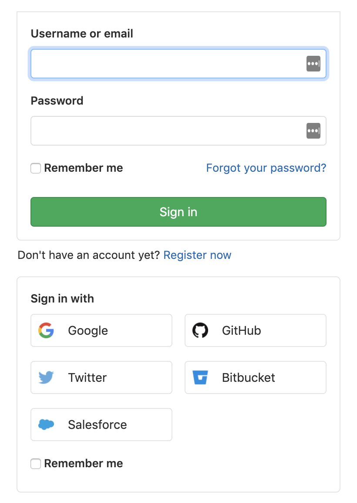

事前にGitHubのパーソナルアクセストークンを取得しておいてください。

以降はGithubのリポジトリをGitLabにミラーリングし、
GitLab CI/CDのパイプラインを動かすまでの流れになります。

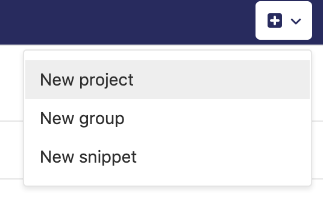

最初に`New project`を選択します。

`CI/CD for external repo`のタブを選択して、
`Connect repositories from`の`GitHub`を選択します。

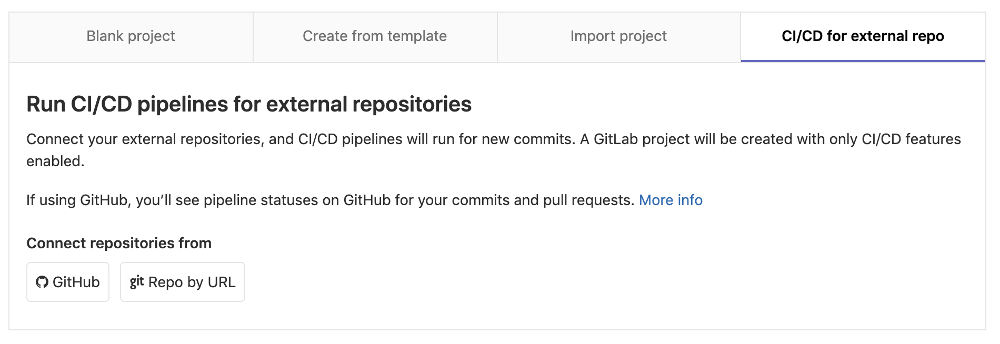

GitHubのパーソナルアクセストークンが要求されるので、
あらかじめ確保されていたものを入力します。

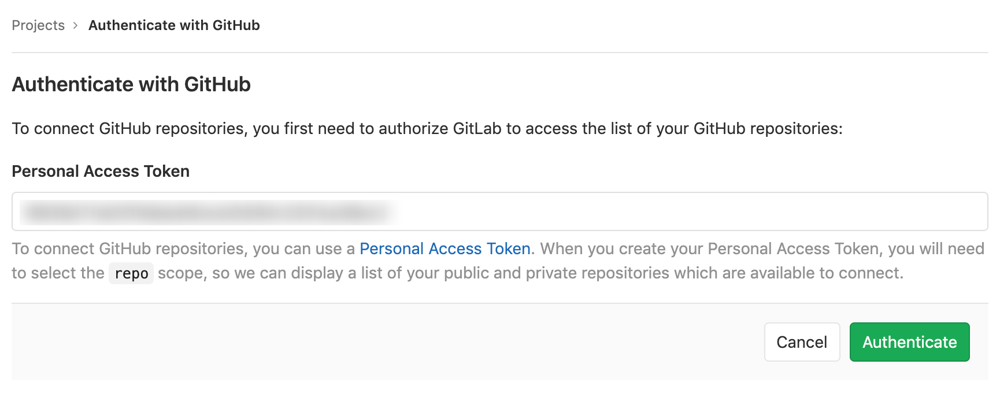

GitHubの認証を行うと、自身の保有するGitHubリポジトリが表示されます。
目的のリポジトリを検索して、`Connect`ボタンをクリックします。

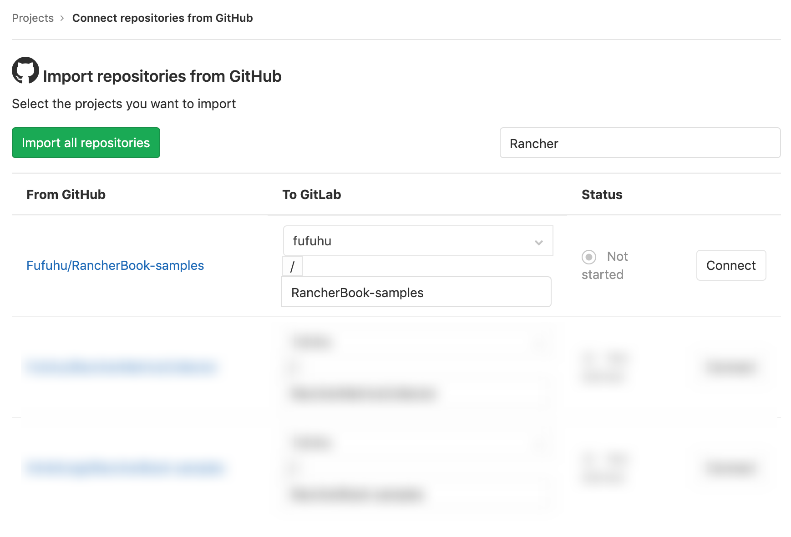

リポジトリのミラーリングがスケジュールされます(ごく短時間で完了します)。

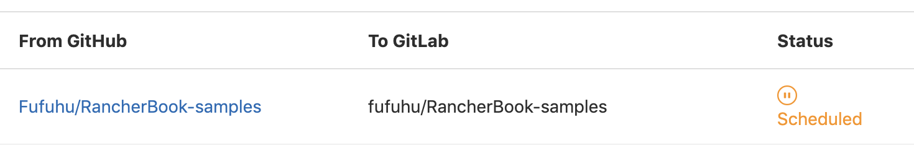

`CI/CD`->`Pipelines`をクリックするとパイプラインの実行結果一覧画面に遷移します。

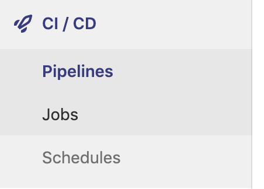

初期時点では実行結果が空なので、`Run Pipeline`をクリックしてブランチを指定して実行してみましょう。

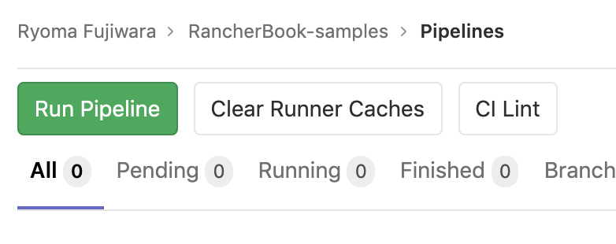

しばらく待つと実行結果が一覧に表示されます。

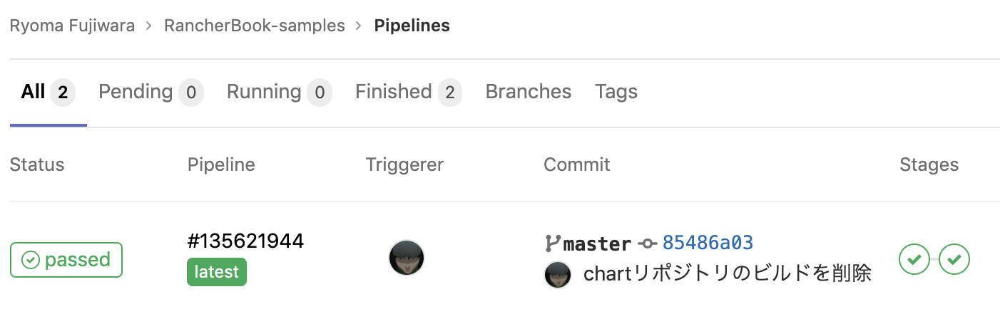

パイプラインの実行結果の詳細を表示すると、パイプライン内のジョブの詳細も確認できます。

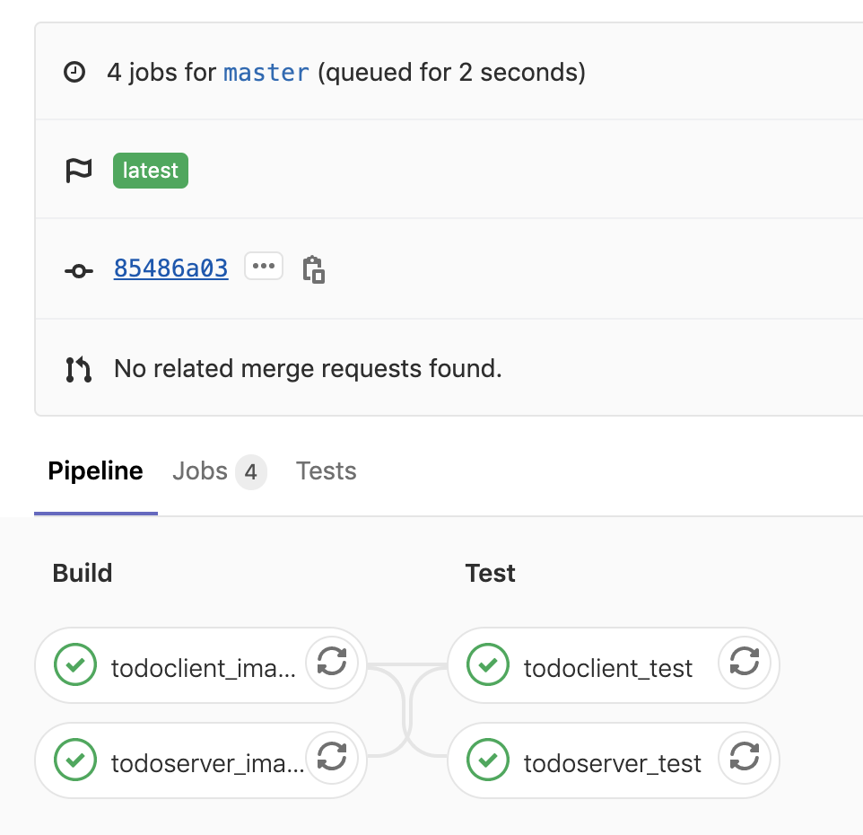

パイプライン内でコンテナイメージをビルドしてレジストリにプッシュしているので、
GitLab Container Registry(GitLab内部のDockerイメージのレジストリ機能)を確認してみます。

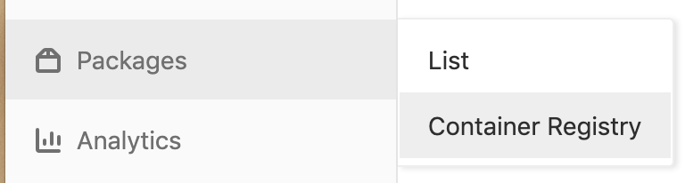

サーバサイドのアプリケーションとクライアントサイドのアプリケーションの両方が作成されています。

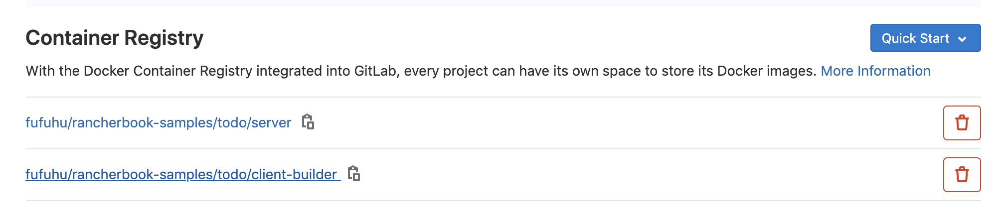

ここまでGitLab CI/CDを使ったパイプライン実行についての手順を確認しました。
では、以降の課題にチャレンジしてみましょう。

## 課題

1. GitLab CI/CDの出力からサーバサイドアプリケーションのテスト結果を見れるようにしましょう。
   + [30_docker-composeを使ったテスト](../20_dockerを使ったローカルテスト/30_docker-composeを使ったテスト.md)の課題記載と同様に[jazzband/django-nose](https://github.com/jazzband/django-nose)または、[xmlrunner/unittest-xml-reporting](https://github.com/xmlrunner/unittest-xml-reporting)を使ってみてください
   + (参考) [JUnit test reports](https://docs.gitlab.com/ee/ci/junit_test_reports.html)
