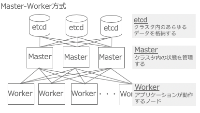
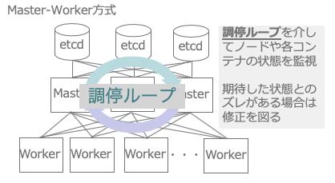
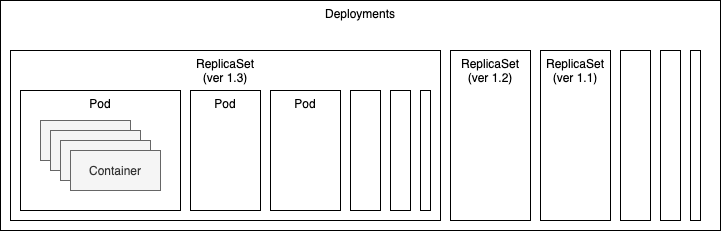
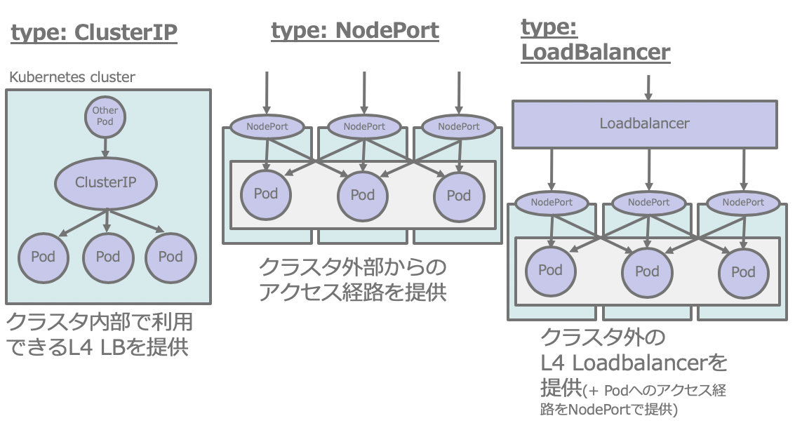
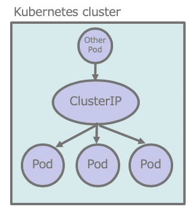
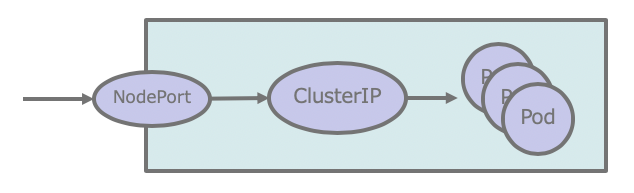

# Kubernetesの解説

ここでは、簡単にKubernetesの概要について解説しつつ、
今回のハンズオンで利用するリソースのDeployments(ReplicaSets,Pod)と
Service(ClusterIPとNodePort)について解説します。

## Kubernetesの概要

[Kubernetes](https://kubernetes.io/)はGoogle内部で利用されていたクラスタマネージャーの[Borg](https://ja.wikipedia.org/wiki/Borg_(%E3%82%AF%E3%83%A9%E3%82%B9%E3%82%BF%E3%83%9E%E3%83%8D%E3%83%BC%E3%82%B8%E3%83%A3))を参考として作成されたコンテナのオーケストレーションシステムです。

Borgについては[論文(Large-scale cluster management at Google with Borg)](https://research.google/pubs/pub43438/)が公開されています。

現在はKubernetesはOSSの形で個人、各種ベンダ、クラウドプロバイダなどを問わず協力して開発を進めている状態です。

また、AWS、GCP、Azureなどの多種多様なパブリッククラウドプロバイダーがマネージドサービスを提供しています。

## 全体のアーキテクチャ

KuberneteshはMaster-Worker方式の形態をとっており、
クラスタ内の状態を管理したりするためのMasterノード、
実際にアプリケーションを含むコンテナが動作するWorkerノード、
クラスタ内およびクラスタにデプロイされたリソースの状態を保管、
管理するためのetcd(注1)を利用します。



(注1) 現在、一部のKubernetesディストリビューションではetcd以外をデータストアとして利用しているものもあります。例えば、今回利用しているk3sはデフォルトでバックエンドにSQLiteを利用するようになっています。

KubernetesはYAMLやJSONで宣言的にデプロイされたリソースの記述内容に
実際のクラスタの状態を近づけるために調停ループを実行して、
あるべき姿(ToBe)と現状(AsIs)の一致を図ろうとします。



宣言型のリソース定義と調停ループの仕組みを用いることで、
クラスタを構成する個別のノードや、デプロイされているコンテナなどの
各種リソースの状態がリソース定義と一致するように常時自クラスタを監視、
修正します。

## 今回利用するリソースの解説

今回のハンズオンでは主に`Deployment`、`Service`の2つのリソースを利用します。
以降はこの2つのリソースについて簡単に解説します。

kubectlをつかって確認したりするといったことが可能ですが、ここではkubectlのコマンドについては解説しません。

### Deployment

Deploymentは名前の通り、アプリケーションのデプロイを管理するためのリソースです。
Deploymentを理解するには、前提として`Pod`と`ReplicaSet`についても理解してもらう必要があるので、この2つについて説明した上でDeploymentsについて解説します。

#### Pod

`Pod`はコンテナの集合です。ネットワーク名前空間を共有しているため、
同一Pod内のコンテナは`localhost`で互いに通信することが可能です。
(イメージ的には単一マシン上でnginxやtomcatなどを一緒に立ち上げてる感じです)

これらの仕組みを用いることで単一のバイナリが起動して動作するための様々なデザインパターンを実装することが可能です(注2)。

(注2)[マイクロサービスの設計パターン](https://docs.microsoft.com/ja-jp/azure/architecture/microservices/design/patterns)のサイドカーなどが典型的な例になります。


#### ReplicaSet

`ReplicaSet`はPodの冗長化のための仕組みです。おなじ構成のPodをいくつクラスタにデプロイするのかを定義することができます。

#### Deployment再び

`Deployment`はReplicaSetの版管理を行うことができます。
つまり、ReplicaSetの更新、ロールバックをDeploymentを用いて実現することができます。内部的にはReplicaSetのレプリカ数を自動で管理する(古い版のものはレプリカ数を0にする)といった仕組みで版管理を実現しています。



+ サンプルのDeployment
```yaml
apiVersion: apps/v1
kind: Deployment
metadata:
  name: nginx-deployment
# Deploymentとしての設定
spec: # ReplicaSetとしての設定
  replicas: 3
  # セレクタを使って管理対象とするPodを指定
  selector:
    matchLabels: # appの値がnginxとなっているPodを
                 # ReplicaSetの管理配下に含める
      app: nginx
  template: # 以降はPodの設定
    metadata:
      labels: # Podに設定するラベル
        app: nginx
    spec:
      containers: # Pod内に含まれるコンテナ設定について記述
        - name: nginx-container
          image: nginx:1.12
          ports: # Podとして外向けに公開するポートを記述
            - containerPort: 80
```

試しに上記リソース(`resource/deployment_sample.yaml`)をデプロイして試してみます。

```console
$ kubectl apply -f ./resource/deployment_sample.yaml 
deployment.apps/nginx-deployment created
```

```console
$ kubectl get all 
NAME                                    READY   STATUS    RESTARTS   AGE
pod/nginx-deployment-66bbfc68bd-b4h9c   1/1     Running   0          6s
pod/nginx-deployment-66bbfc68bd-gxcgm   1/1     Running   0          6s
pod/nginx-deployment-66bbfc68bd-rf8p2   1/1     Running   0          6s


NAME                 TYPE        CLUSTER-IP   EXTERNAL-IP   PORT(S)   AGE
service/kubernetes   ClusterIP   10.96.0.1    <none>        443/TCP   57m


NAME                               READY   UP-TO-DATE   AVAILABLE   AGE
deployment.apps/nginx-deployment   3/3     3            3           6s

NAME                                          DESIRED   CURRENT   READY   AGE
replicaset.apps/nginx-deployment-66bbfc68bd   3         3         3       6s
```

Deployment、ReplicaSetがそれぞれ一つずつ、Podが3つデプロイされていることが確認できます。

試みに、コンテナのイメージ(`image`)のタグを`latest`にして再度デプロイしてみます。

```console
$ kubectl apply -f ./resource/deployment_sample.yaml 
deployment.apps/nginx-deployment configured
```

`image`の値が変更になっているため、その部分をカバーするためにKubernetesはクラスタ内のリソースの構成を変更します。

変更結果を確認すると以下のようになっています。

```console
$ kubectl get all
NAME                                    READY   STATUS    RESTARTS   AGE
pod/nginx-deployment-697947b5f5-flmdf   1/1     Running   0          41s
pod/nginx-deployment-697947b5f5-q8snb   1/1     Running   0          52s
pod/nginx-deployment-697947b5f5-qlhht   1/1     Running   0          39s 
〜〜〜省略〜〜〜
NAME                                          DESIRED   CURRENT   READY   AGE
replicaset.apps/nginx-deployment-66bbfc68bd   0         0         0       3m56s
replicaset.apps/nginx-deployment-697947b5f5   3         3         3       52s
```

ReplicaSetリソース(`nginx-deployment-697947b5f5`)が新しく作られており、
古いReplicaSetリソース(`nginx-deployment-66bbfc68bd`)は`replicas`の値(`DESIRED`に対応)が0にされています。
(こっそりPodも入れ替わっている点にも着目してください)

新しく作成されたReplicaSetの設定を確認すると、`Image`の値が`nginx:1.12`から`nginx:latest`に変わっていることがわかります。

```console
$ kubectl describe replicaset.apps/nginx-deployment-697947b5f5
Name:           nginx-deployment-697947b5f5
Namespace:      default
Selector:       app=nginx,pod-template-hash=697947b5f5
Labels:         app=nginx
                pod-template-hash=697947b5f5
Annotations:    deployment.kubernetes.io/desired-replicas: 3
                deployment.kubernetes.io/max-replicas: 4
                deployment.kubernetes.io/revision: 2
Controlled By:  Deployment/nginx-deployment
Replicas:       3 current / 3 desired
Pods Status:    3 Running / 0 Waiting / 0 Succeeded / 0 Failed
Pod Template:
  Labels:  app=nginx
           pod-template-hash=697947b5f5
  Containers:
   nginx-container:
    Image:        nginx:latest
    Port:         80/TCP
    Host Port:    0/TCP
    Environment:  <none>
    Mounts:       <none>
  Volumes:        <none>
Events:
  Type    Reason            Age   From                   Message
  ----    ------            ----  ----                   -------
  Normal  SuccessfulCreate  2m3s  replicaset-controller  Created pod: nginx-deployment-697947b5f5-q8snb
  Normal  SuccessfulCreate  112s  replicaset-controller  Created pod: nginx-deployment-697947b5f5-flmdf
  Normal  SuccessfulCreate  110s  replicaset-controller  Created pod: nginx-deployment-697947b5f5-qlhht
```

確認が終わったので、リソースを削除します。

```console
$ kubectl delete -f ./resource/deployment_sample.yaml
```


### Service

`Service`は外部および、内部でのPod間のアクセスパスを提供するための仕組みです。
3種類のタイプ(`ClusterIP`, `NodePort`, `LoadBalanacer`)が存在します。



`LoadBalancer`は、クラスタ外のL4レイヤのロードバランサと連携させるためのリソースです。クラスタ外といっても、実際には[MetalLB](https://metallb.universe.tf/)のようにクラスタ内に作られたものを利用する場合もあります。今回は利用しないので、これ以上の解説はしません。

#### ClusterIP

`ClusterIP`複数のPodへのアクセス経路を提供するための内部L4ロードバランサです。
`selector`を使ったPodに付与されたラベルで、ルーティングする先のPodとの紐付けを定義します。



+ ClusterIPタイプのServiceのサンプル(`resource/clusterip_sample.yaml`から抜粋)
```yaml
apiVersion: v1
kind: Service
metadata:
  name: nginx-service
spec:
  type: ClusterIP
  ports:
    - name: http-port
      protocol: TCP # プロトコルはTCP
      port: 80 # TCP:80で受けたパケットを
      targetPort: 80 # 配下にぶら下がっているPodのTCP:80に流す
  # セレクタを使ってぶら下がるPodを指定
  selector:
    # ラベルとして、appの値がnginxとなっているPodにリクエストをルーティングする
    app: nginx  
```

では、サンプルをデプロイしてみましょう。
Deploymentリソースについてはすでに解説済みなので解説しません。

```console
$ kubectl apply -f ./resource/clusterip_sample.yaml
```

```console
$ kubectl get services
NAME            TYPE        CLUSTER-IP       EXTERNAL-IP   PORT(S)   AGE
kubernetes      ClusterIP   10.96.0.1        <none>        443/TCP   71m
nginx-service   ClusterIP   10.108.175.234   <none>        80/TCP    2m3s
```

`kubernetes`サービスについてはKubernetesのシステムリソースなので無視します。
`nginx-service`がデプロイされていることが確認できます。この詳細を確認してみましょう。

```console
$ kubectl describe service/nginx-service
Name:              nginx-service
Namespace:         default
Labels:            <none>
Annotations:       kubectl.kubernetes.io/last-applied-configuration:
                     {"apiVersion":"v1","kind":"Service","metadata":{"annotations":{},"name":"nginx-service","namespace":"default"},"spec":{"ports":[{"name":"h...
Selector:          app=nginx
Type:              ClusterIP
IP:                10.108.175.234
Port:              http-port  80/TCP
TargetPort:        80/TCP
Endpoints:         10.1.0.17:80,10.1.0.18:80,10.1.0.19:80
Session Affinity:  None
Events:            <none>
```

`Endpoints`がこのサービスに紐付いているPodのIPアドレス(とポート番号のリストです)
`kubectl describe`を使ってPodの設定なども確認しつつ、nginx-serviceとその配下のPodの関係について調べてみても良いでしょう。

諸々の確認が終わったらデプロイしたリソースを削除します。

```console
$ kubectl delete -f ./resource/clusterip_sample.yaml
```


#### NodePort

`NodePort`はKubernetesクラスタを構成するノードのポートを使って
外部からのアクセス経路を準備するためのリソースです。
内部的には`NodePort->ClusterIP->Pod`の順で通信が流れます。
`ClusterIP`リソースは暗黙的に作成されるのでその点注意してください。



+ NodePortタイプのServiceのサンプル(`resource/nodeport_sample.yaml`より抜粋)
```yaml
apiVersion: v1
kind: Service
metadata:
  name: nginx-nodeport-service
spec:
  type: NodePort
  ports:
    - name: http-port
      protocol: TCP # プロトコルはTCP
      nodePort: 30080 # ノードから外部向けに公開するポート
      port: 80 # TCP:80で受けたパケットを
      targetPort: 80 # 配下にぶら下がっているPodのTCP:80に流す
  # セレクタを使ってぶら下がるPodを指定
  selector:
    # ラベルとして、appの値がnginxとなっているPodにリクエストをルーティングする
    app: nginx  
```

この場合はクラスタを構成するノードのTCPの10080番ポートにアクセスすると、
配下にぶら下がっているPodにアクセスがルーティングされます。

では、サンプルコードをデプロイしてみましょう。

```console
$ kubectl apply -f ./resource/nodeport_sample.yaml 
service/nginx-nodeport-service created
deployment.apps/nginx-deployment created
```

```console
$ kubectl get services
NAME                     TYPE        CLUSTER-IP      EXTERNAL-IP   PORT(S)        AGE
kubernetes               ClusterIP   10.96.0.1       <none>        443/TCP        92m
nginx-nodeport-service   NodePort    10.106.135.20   <none>        80:30080/TCP   4m8s
```

nginx-nodeport-serviceが`NodePort`として作成されています。また、`CLUSTER-IP`が付与されていることから
暗黙的に`ClusterIP`リソースも含んでいることがわかります。

ブラウザで仮想マシンの30080番ポートにアクセスするとNginxのデフォルト画面が表示されるはずです。

諸々の確認が終わったらリソースを削除します。

```console
$ kubectl delete -f ./resource/nodeport_sample.yaml
```