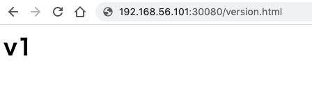
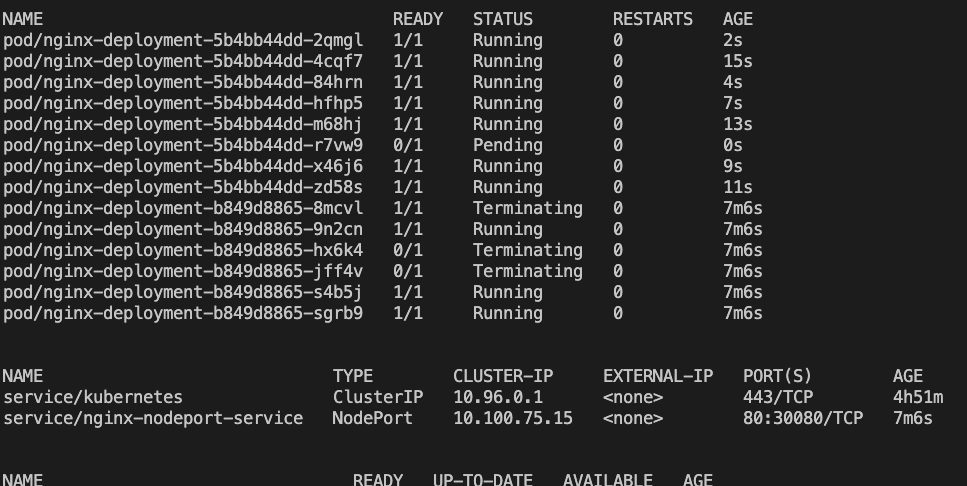
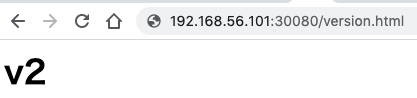

# Kubernetesを使ったローリングデプロイ

Kubernetesの`Deployment`を使ったローリングデプロイをここでは体験します。

ローリングデプロイは徐々にリソースを入れ替えるので、
B/Gデプロイと比較すると全体で必要とするリソースを小さく保つことができる利点があります。
一方で一気に切り替えるのではなく、徐々に切り替えるのでデプロイがすべて完了するまでの時間が長くなったり、
切り戻しにかかる時間が長くなりがちであるという点については注意が必要です。

Deploymentでは、デプロイ戦略(Deploy strategy)として
`RollingUpdate`（デフォルト)と`Recreate`が存在します。
`RollingUpdate`は既存のPodと新しいPodを入れ替えながらデプロイを行うため、
処理を行う新旧のPodが混ざってしまうという注意点はありますが、
基本的には無停止でデプロイを実現することができます。

一方で、`Recreate`は一度既存のPodを削除した後に、新しいPodを立ち上げるため、
停止が発生する点に注意が必要です。

今回は、`RollingUpdate`を体験します。

デフォルトでも可能ですが、具体的な設定方法についても確認しましょう。

+ （`resource/rolling_deploy_v1.yaml`から抜粋)
```yaml
apiVersion: apps/v1
kind: Deployment
metadata:
  name: nginx-deployment
spec: 
  replicas: 10
  selector:
    matchLabels: 
      app: nginx
  strategy: # デプロイ戦略の指定
    rollingUpdate: # RollingUpdate
      maxSurge: 1 # replicasの許容超過数(1 Podまでは超過可)
      maxUnavailable: 0 # replicasの許容不足数(不足は許容しない)
  template: 
    metadata:
      labels:
        app: nginx
    spec:
      containers: 
        - name: nginx-container
          image: fufuhu/bootcamp-rolling-nginx:v1
          ports: 
            - containerPort: 80
```

特にポイントとなっているのは、`strategy`の部分です。

```yaml
  strategy: # デプロイ戦略の指定
    rollingUpdate: # RollingUpdate
      maxSurge: 1 # replicasの許容超過数(1 Podまでは超過可)
      maxUnavailable: 0 # replicasの許容不足数(不足は許容しない)
```

コメントにも記載している通りの内容ですが、
`maxSurge`はローリングデプロイを実行している際に、
実行中のPodが`replicas`の値をいくつまで超過することを許容するかを表しています。
`maxUnavailable`はローリングデプロイを実行している間に、
実行中のPodが`replicas`の値をいくつまで下回ってよいかを表します。

上記の例では、Podの数で制御していますが、両パラメータともに、%で定義することも可能です。

`maxSurge`を大きくしすぎると、ノードのリソースの不足してしまうリスクがあります。
`maxUnavailable`を大きくしすぎると、
正常に動作しているPodの数が減りすぎ、
意図した処理を実行できなくなってしまう可能性が生じます。

では、早速試してみましょう。

```console
$ kubectl apply -f resource/rolling_deploy_v1.yaml
```

10個のPodがデプロイされています。

```console
$ kubectl get all
NAME                                   READY   STATUS    RESTARTS   AGE
pod/nginx-deployment-b849d8865-6c7v5   1/1     Running   0          17s
pod/nginx-deployment-b849d8865-8mcvl   1/1     Running   0          17s
pod/nginx-deployment-b849d8865-9n2cn   1/1     Running   0          17s
pod/nginx-deployment-b849d8865-dnq25   1/1     Running   0          17s
pod/nginx-deployment-b849d8865-hx6k4   1/1     Running   0          17s
pod/nginx-deployment-b849d8865-jcfww   1/1     Running   0          17s
pod/nginx-deployment-b849d8865-jff4v   1/1     Running   0          17s
pod/nginx-deployment-b849d8865-m42wm   1/1     Running   0          17s
pod/nginx-deployment-b849d8865-s4b5j   1/1     Running   0          17s
pod/nginx-deployment-b849d8865-sgrb9   1/1     Running   0          17s


NAME                             TYPE        CLUSTER-IP     EXTERNAL-IP   PORT(S)        AGE
service/kubernetes               ClusterIP   10.96.0.1      <none>        443/TCP        4h44m
service/nginx-nodeport-service   NodePort    10.100.75.15   <none>        80:30080/TCP   17s


NAME                               READY   UP-TO-DATE   AVAILABLE   AGE
deployment.apps/nginx-deployment   10/10   10           10          17s

NAME                                         DESIRED   CURRENT   READY   AGE
replicaset.apps/nginx-deployment-b849d8865   10        10        10      17s
```

Webブラウザから`service/nginx-nodeport-service`に記載がある通り、
ノードの30080番ポートにアクセス(`http://192.168.56.101:30080/version.html`)します。



画面にv1と表示されていれば問題ありません。

では、ローリングデプロイのために新しいバージョンのイメージをデプロイします。
`watch`コマンドを用いるので予め`brew install watch`を実行してインストールおいてください。

```console
$ kubectl apply -f resource/rolling_deploy_v2.yaml
```

```console
$ watch kubectl get all
```



徐々に入れ替わっていく様子が見えるはずです(PodのAGEに注目)。



ブラウザでアクセスし続けるとv1と表示されたいたのがv2に切り替わるときがあると思います。
最終的には、すべてのPodがv2のものに切り替わるはずです。
