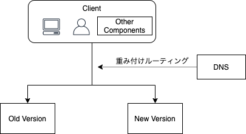
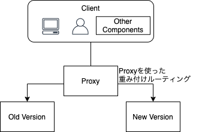
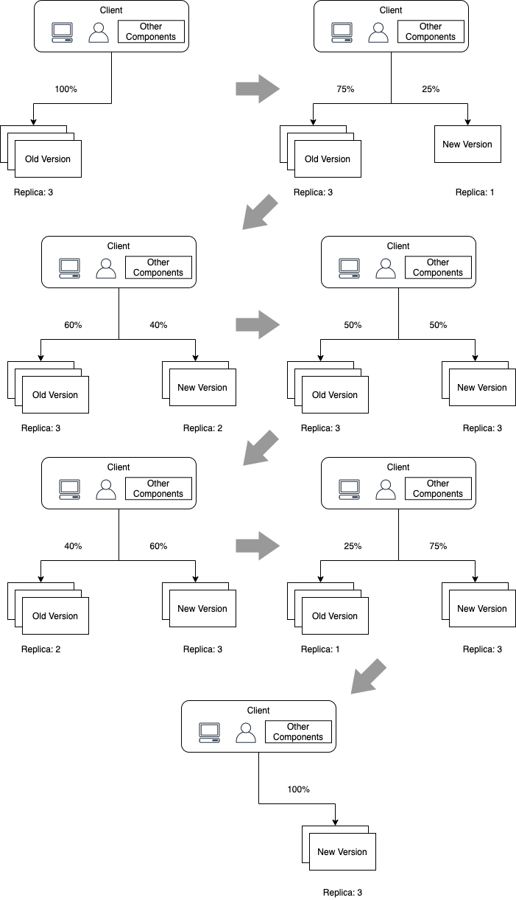

# カナリアリリース

カナリアリリースは様々な手段が存在します。
よくあるパターンとともに、解説します。

ここではハンズオンの時間の関係上、具体的な課題はあたえず解説のみに留めます。
時間を見つけて自分でトライしてみましょう。

## カナリアリリースのパターン

カナリアリリースとしては大きく分けて以下の3種類が存在します。
(他にも様々な方法があるかもしれません)

1. DNSの重み付けルーティングを使ったカナリアリリース
2. プロキシを用いたカナリアリリース
3. ローリングデプロイ的なカナリアリリース

以降はそれぞれの方法について解説します。

### DNSの重み付けルーティングを使ったカナリアリリース

DNSの重み付けルーティング/ラウンドロビン(Weighted routing/Weighted round robin)を使ったカナリアリリースです。

ただし、クライアントのDNSキャッシュに依存する点には注意が必要です。

+ 参考
  + [20191105 AWS Black Belt Online Seminar Amazon Route 53 Hosted Zone](https://www.slideshare.net/AmazonWebServicesJapan/20191105-aws-black-belt-online-seminar-amazon-route-53-hosted-zone-193836805)

### プロキシを用いたカナリアリリース

デプロイ対象の前にプロキシを配置して利用するパターンです。
サービスメッシュなどの仕組みを利用して実現することが多いですが、
単純にNginxなどを挟んで実現することも可能です。

基本的にL7レイヤベースでルーティングを行うのでもっとも細かい制御が可能です。
一方でその分内部のアーキテクチャや設定項目なども複雑になる点には注意が必要です。

+ よく使われるツール
  + [Istio](https://istio.io/)
  + [Envoy](https://www.envoyproxy.io/)
    + Istioの内部にも含まれています

### ローリングデプロイ的なカナリアリリース

ローリングデプロイ的な方法を用いて実現する方法です。
[Argo Rollouts](https://argoproj.github.io/argo-rollouts/)などがこの仕組みを利用しているようです。

